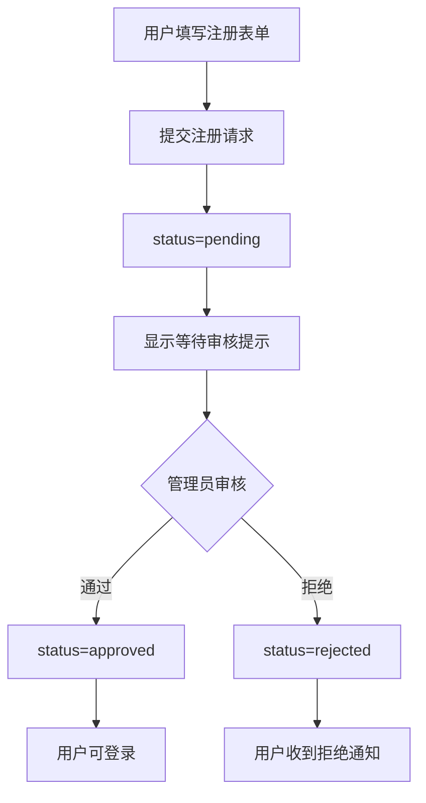
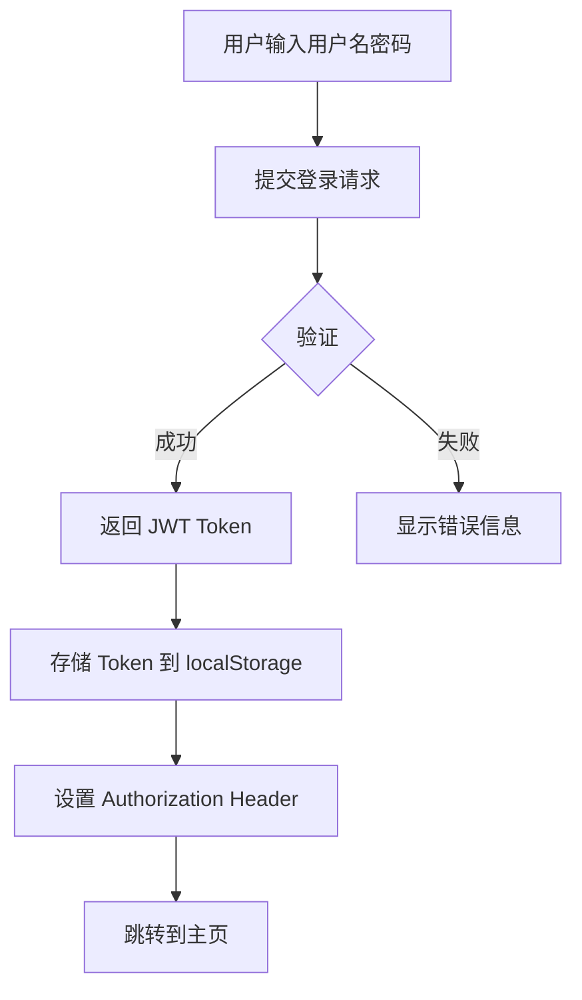

# 用户认证系统设计文档

> 创建日期: 2026-02-18
> 状态: 已批准

## 1. 概述

为 POS Scanner Web 平台添加用户认证系统，支持：
- 用户注册（管理员审核模式）
- 用户登录（JWT Token 认证）
- 管理员审核用户注册申请
- 管理员重置用户密码

## 2. 技术选型

| 层级 | 技术 | 版本 |
|------|------|------|
| 后端认证 | Flask-JWT-Extended | >=4.5.0 |
| 数据库 | SQLite + Flask-SQLAlchemy | >=3.0.0 |
| 密码加密 | werkzeug.security (pbkdf2:sha256) | 内置 |
| 前端路由 | react-router-dom | ^6.x |
| 状态管理 | React Context | 内置 |

## 3. 数据库设计

### 用户表 (users)

| 字段 | 类型 | 约束 | 说明 |
|------|------|------|------|
| id | INTEGER | PRIMARY KEY | 主键 |
| username | VARCHAR(50) | UNIQUE, NOT NULL | 用户名 |
| password_hash | VARCHAR(256) | NOT NULL | 密码哈希 |
| email | VARCHAR(100) | UNIQUE, NOT NULL | 邮箱 |
| role | VARCHAR(20) | DEFAULT 'user' | 角色: admin / user |
| status | VARCHAR(20) | DEFAULT 'pending' | 状态: pending / approved / rejected |
| created_at | DATETIME | DEFAULT NOW | 创建时间 |
| updated_at | DATETIME | DEFAULT NOW | 更新时间 |

### 初始数据

首次启动时自动创建默认管理员账户：
- 用户名: `admin`
- 密码: `admin123` (首次登录后应修改)
- 角色: `admin`
- 状态: `approved`

## 4. API 设计

### 认证接口 (/api/auth)

| 方法 | 端点 | 说明 | 权限 |
|------|------|------|------|
| POST | `/register` | 用户注册 | 公开 |
| POST | `/login` | 用户登录 | 公开 |
| POST | `/logout` | 用户登出 | 已登录 |
| GET | `/profile` | 获取当前用户信息 | 已登录 |
| PUT | `/password` | 修改密码 | 已登录 |

### 管理员接口 (/api/admin)

| 方法 | 端点 | 说明 | 权限 |
|------|------|------|------|
| GET | `/users` | 获取用户列表 | admin |
| PUT | `/users/<id>/approve` | 审核通过 | admin |
| PUT | `/users/<id>/reject` | 审核拒绝 | admin |
| PUT | `/users/<id>/reset-password` | 重置密码 | admin |
| DELETE | `/users/<id>` | 删除用户 | admin |

### 请求/响应示例

**注册请求**
```json
POST /api/auth/register
{
  "username": "newuser",
  "password": "password123",
  "email": "user@example.com"
}
```

**登录响应**
```json
{
  "success": true,
  "access_token": "eyJ0eXAi...",
  "refresh_token": "eyJ0eXAi...",
  "user": {
    "id": 1,
    "username": "admin",
    "email": "admin@example.com",
    "role": "admin"
  }
}
```

## 5. 前端设计

### 页面结构

| 页面 | 路由 | 说明 | 权限 |
|------|------|------|------|
| 登录页 | `/login` | 用户登录 | 公开 |
| 注册页 | `/register` | 用户注册 | 公开 |
| 扫描页 | `/` | 设备扫描（主页） | 已登录 |
| 用户管理页 | `/admin/users` | 管理员审核用户 | admin |

### 组件结构

```
frontend/src/
├── components/
│   ├── auth/
│   │   ├── LoginForm.jsx       # 登录表单
│   │   ├── RegisterForm.jsx    # 注册表单
│   │   └── PrivateRoute.jsx    # 路由守卫
│   └── admin/
│       └── UserTable.jsx       # 用户列表表格
├── pages/
│   ├── LoginPage.jsx           # 登录页
│   ├── RegisterPage.jsx        # 注册页
│   └── AdminUsersPage.jsx      # 用户管理页
├── contexts/
│   └── AuthContext.jsx         # 认证状态管理
└── services/
    └── authService.js          # 认证 API 调用
```

### 路由守卫逻辑

```javascript
// PrivateRoute: 保护需要登录的页面
<Route element={<PrivateRoute />}>
  <Route path="/" element={<ScanPage />} />
</Route>

// AdminRoute: 保护管理员页面
<Route element={<AdminRoute />}>
  <Route path="/admin/users" element={<AdminUsersPage />} />
</Route>
```

## 6. 用户流程

### 注册流程



### 登录流程



## 7. Token 策略

| 项目 | 配置 |
|------|------|
| Access Token 有效期 | 2 小时 |
| Refresh Token 有效期 | 7 天 |
| Token 存储 | localStorage |
| 自动刷新 | Access Token 过期前自动刷新 |
| 登出处理 | 清除 localStorage 中的 Token |

## 8. 后端文件结构

```
backend/
├── models/
│   ├── __init__.py
│   └── user.py              # 用户模型
├── routes/
│   ├── __init__.py
│   ├── auth.py              # 认证路由
│   └── admin.py             # 管理员路由
├── extensions.py            # Flask 扩展初始化 (JWT, SQLAlchemy)
├── config.py                # 更新: JWT 配置
├── app.py                   # 更新: 注册蓝图
└── requirements.txt         # 更新: 新依赖
```

## 9. 安全考虑

1. **密码存储**: 使用 pbkdf2:sha256 加密，不存储明文密码
2. **JWT 密钥**: 使用环境变量配置，不硬编码
3. **CORS**: 限制允许的源
4. **输入验证**: 验证所有用户输入
5. **错误信息**: 不暴露敏感信息

## 10. 实施计划

详见后续实现计划文档。
